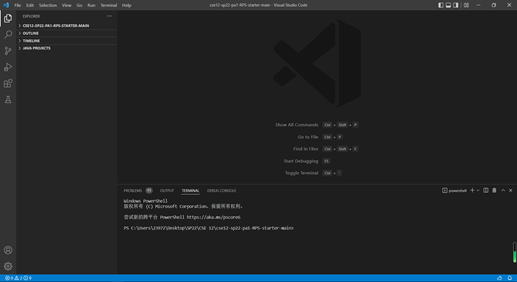
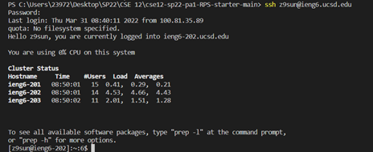
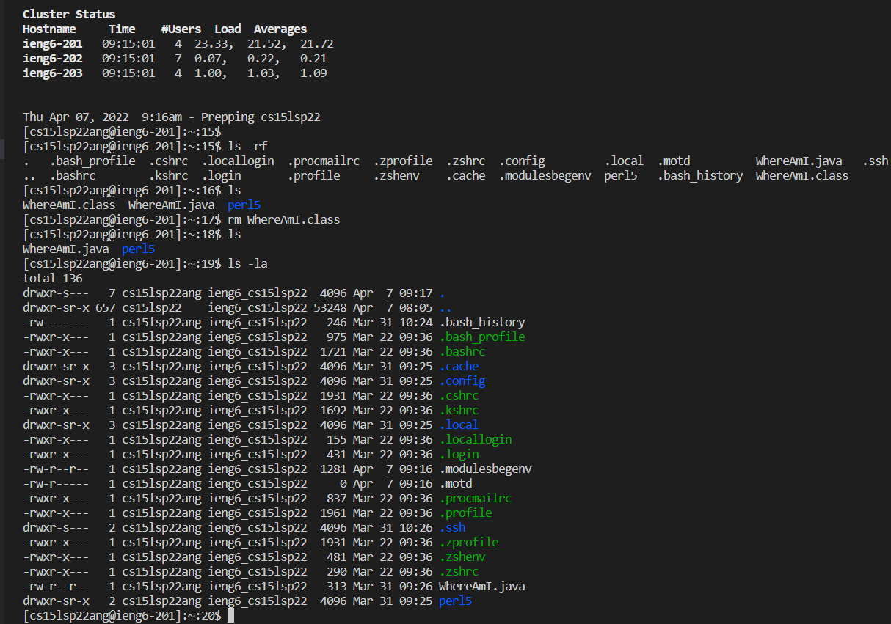
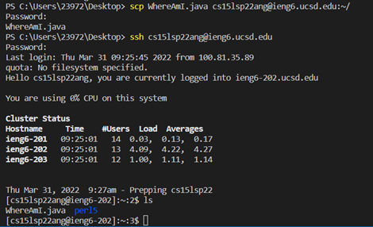
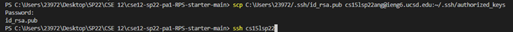
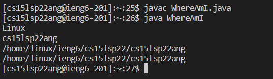

# How to access remotely to a server (eg. ieng6)?

* Installing VSCode
1. The first step we should do is install **VSCode** from its official [website](https://code.visualstudio.com/).
2. After **installation**, we are able to find the initial and primary interface of VSC just as the following picture.

* Remotely Connecting
1. As a **Windows** computer, the first thing to do is [Install OpenSSH](https://docs.microsoft.com/en-us/windows-server/administration/openssh/openssh_install_firstuse)!
2. After doing so, taking **ieng6** as an example, we are able to find our course-specific account [here](https://sdacs.ucsd.edu/~icc/index.php).
3. Open a terminal in VSC and type in `ssh + username@ieng6.ucsd.edu` (mine is cs15lsp22ang)
4. When connecting the server for the first time, it will ask you `Are you sure you want to continue connecting (yes/no/[fingerprint])?`. When you type `yes` and press `enter`
5. Then if you log into the server **successfully**, we are able to see the output just like the following picture.

* Trying Some Commands
1. The following are some useful commands in the implementation of *Linux*. It's quite interesting to make some explorations on them:
`pwd`, 
`mkdir`, 
`cp`, 
`cd ~`, 
`cd`, 
`ls -lat`, 
`ls -a`...
2. This screenshot contains some examples from the above:

* Moving files with `scp`
1. On local computer, we first set up a file named `WhereAmI.java`, and contains the following code:

`class WhereAmI {

    public static void main(String[] args) {
        System.out.println(System.getProperty("os.name"));
        System.out.println(System.getProperty("user.name"));
        System.out.println(System.getProperty("user.home"));
        System.out.println(System.getProperty("user.dir")) 
        }
    }`
2. After compling on local computer, we can find it outputting the current **operating system**.
3. Then we use `scp WhereAmI.java cs15lsp22zz@ieng6.ucsd.edu:~/` to copy the local file to the server, and the result is showing as following.

* Setting an SSH Key
1. One
2. Two
3. Three

* Optimizing Remote Running
1. As previously we have copy `WhereAmI.java` onto the server, so we are able to compile and implement the file on server.
2. After we run `javac WhereAmI.java` and `java WhereAmI`, we can see the output contains the operating system *Linux* and also our username for CSE 15L.

