# How to find a *failure-inducing input*, and use it to test and debug our code efficiently?
## Setups
> In this lab report, we will mainly focus on incremental and test-driven development that can let us test and debug our program more easily, logically and effieciently.


* The first step is to use the **Fork** function of Github, it can makes a copy of the repository on your own Github page.


* Then we **Fetch** this repository to our Github desktop in order to implement the debug process on our own Visual Studio Code:


```
javac MarkdownParse.java
java MarkdownParse test-file.md
```

## Breaking Tests
> The following are different **breaking tests** under different situations that I found during the testing and debugging process of `MarkdownParse.java`.

### Test 1：Infinite loop
> The first breaking test case is happening when I add one extra blank line at the end of the test-file markdown.
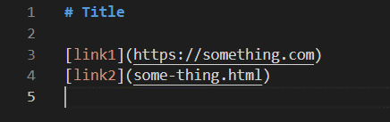


* Code changes:

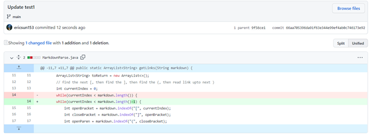

* [Here](https://github.com/ericsun153/markdown-parser/blob/main/test-file.md) is the link to my breaking test case 1 of **Infinite Loop**.

* Symptom:

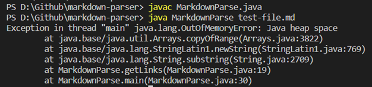

* In this test case, the *failure-inducing input* is a blank line at the end of the file. After running the program, we can see that this input has caused the *symptom* of a `java.lang.OutOfMemoryError`, which means some loops in our program are running indefinitively. 
This *bug* which causes this symptom is appeared in **line 14**. Specially to this test case, we add `markdown.length()-1` in order to end the while loop at the last blank line in the test case.

* After the specified improvement to this test case, we are able to successfully find and get the correct output of `[https://something.html, some-thing.html]` as the following picture:
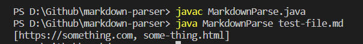

### Test 2: Image contained test
> This breaking test is appearing when we insert the images among the syntax of links.
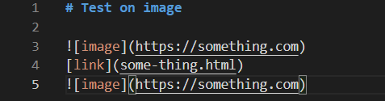


* Code changes:

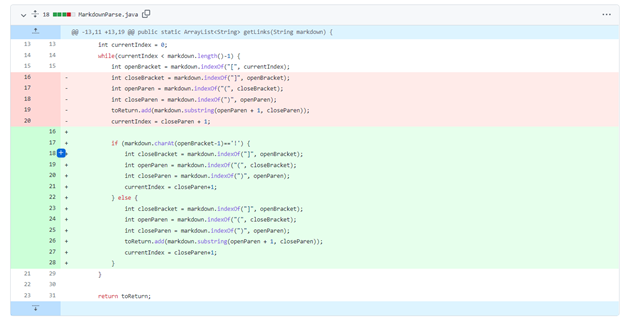

* [Here](https://github.com/ericsun153/markdown-parser/blob/main/test3.md) is the link to my breaking test case 2 of **Containing Image**.

* Symptom:

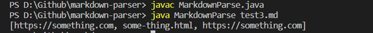

* In this test case, the *failure-inducing input* is an image-related input. After running the program, we can see that this input has caused the *symptom* of a wrong output. We expected to get `[some-thing.html]`, but we get all the output even include the file path of the image. This *bug* which causes this symptom is appeared in the *while loop* starting from **line 14**. In order to fix this *bug*, we add an `if` statement with the condition of `markdown.charAt(openBracket-1)=="!"` to specifically deal with the **image input**.

* After the specified improvement to this test case, we are able to successfully find and get the correct output of `[some-thing.html]` as the following picture:

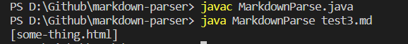

### Test 3: More complicated and general cases
> In this topic, we will explore on more complicated and edge cases to make our `MarkdownParse.java` to break down.

* Code changes:

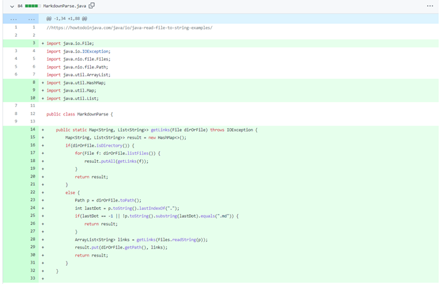
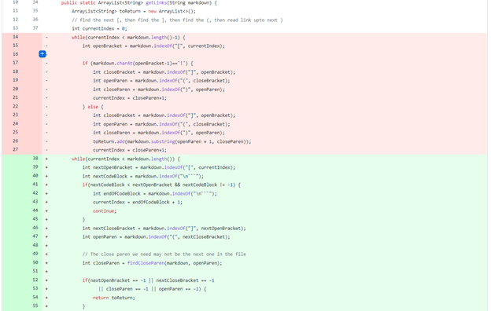
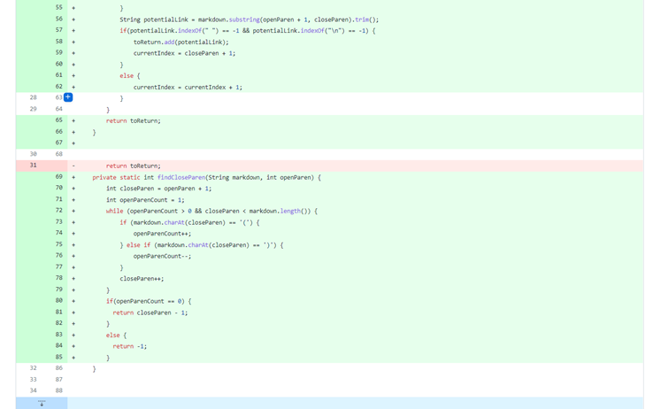

#### 3.1 File with a link in the middle
* Test case:

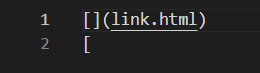

* Test 3.1 Link [here](https://github.com/ericsun153/markdown-parser/blob/main/test8.md).

* Symptom:

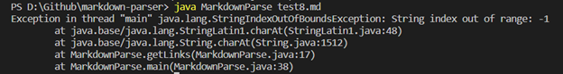

* In this test case, the *failure-inducing input* is that the link is in the middle of the file and there is only an open bracket in the second line. After running the program, we can see that this input has caused the *symptom* of a `IndexOutOfBoundException`, which means we do not completely implement the index increment and decrement. I think this *bug* which causes this symptom is quite a logical error to the *while loop*.

* So in order to deal with this *bug*, I re-construct and re-design my program implementing a helper method called `findCloseParen` to quick get the position of closeparen. Moreover, I override the method of `getLinks` using the hashmap in order to find the valid website links and store it in the key of the hashmap by finding the index of *the dot* in the file.

* After improving, the output should be `[link.html]`:

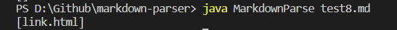

#### 3.2 File that uses `[]` but not `()`
* Test case:

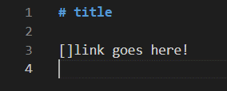

* Test 3.2 Link [here](https://github.com/ericsun153/markdown-parser/blob/main/test5.md).

* Symptom:

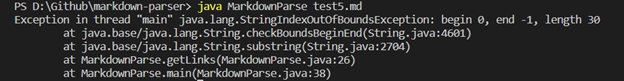

* In this test case, the *failure-inducing input* is that the test file only uses `[]` but not `()`. After running the program, we can see that this input has caused the *symptom* of a `IndexOutOfBoundException`.
Our re-designed program can still be applied here to solve the *bug*. As the new logic for my program is that whenever there is a valid link with dot within an openparen and closeparen, it will be added to the key variable of the hashmap. Therefore, we expect to get the output of `[]` here.

* After improving, the output should be `[]`:

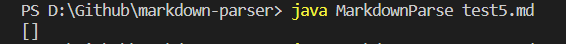

#### 3.3 File with no links
* Test case:

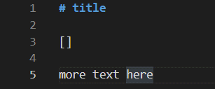

* Test 3.3 Link [here](https://github.com/ericsun153/markdown-parser/blob/main/test4.md).

* Symptom:

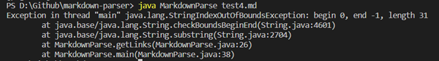

* In this test case, the *failure-inducing input* is that there is no link in the file. After running the program, we can see that this input has caused the *symptom* of a `IndexOutOfBoundException`, as there is no open and close parentheses, the index of the `OpenParen` cannot be found. So for the program after change, as there is no `closeParen` to be found, the method will return -1, and `getLinks` will directly return `[]`.

* After improving, the output should be `[]`:

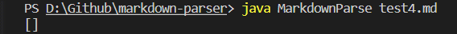
