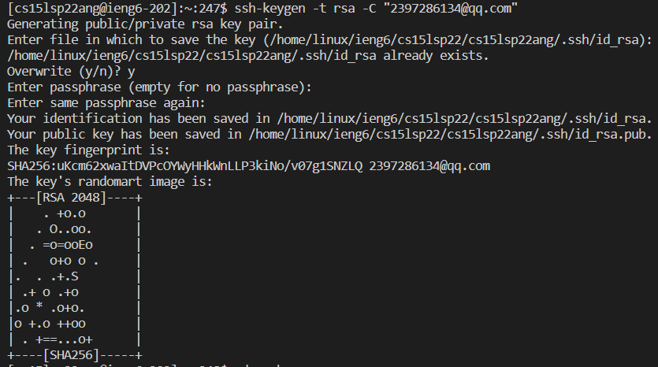
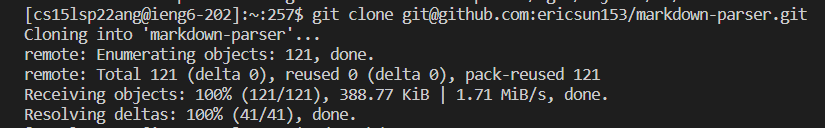
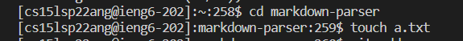
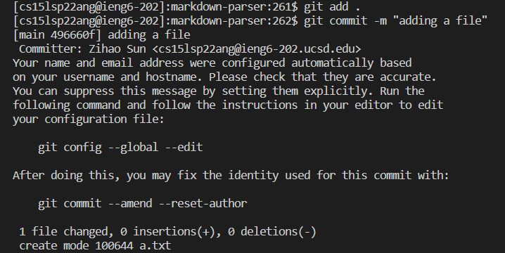
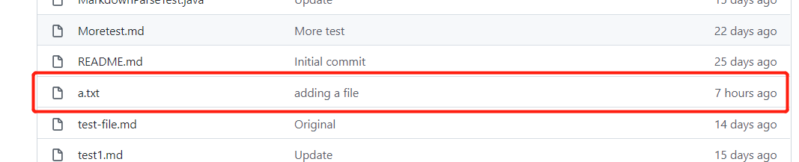
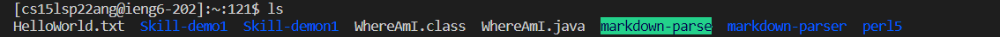
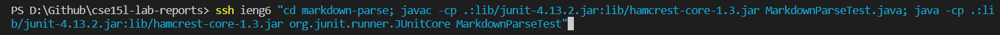
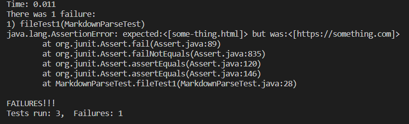

# How can we access our Github on the server of `ieng6`?
## Streamlining ssh Configuration
* First of all, we should find the **.ssh** folder on our local computer. (Mine is in the local user profile)


* After we going into the folder, we can already see the file called **id_rsa.pub** that we used it to store our passward on this local computer so that we can login the server without typing the passward.

* So now we want to make the login process even more quicker. Firstly we create a **txt** file called **config.txt**, and I put the following text into it:
```
Host ieng6
    HostName ieng6.ucsd.edu
    User cs15lsp22ang (This is my username)
```
* Then we save the file and delete the extension of **txt**. 


* At last we open the Terminal and directly type `ssh ieng6`, and we can see that new login is faster and easier to type!


* What if we want to copy a file from local computer to the server? We use the command of `scp`. Firstly we copy the file onto the server:


* After that, we log back onto the server and we are able to see that the **HelloWorld.txt** has been successfuly copied to *ieng6*.


## Setup Github Access from ieng6
* For this step, we firstly clone our repositary of **markdown-parser** onto the *ieng6* server.


* Now after making some changes to the **MarkdownParse.java**, when we `push` the file back to the Github, we can find that it appears an error for that we cannot use the password authentication to access Github.


* In this situation, we generate a new public key for the Github by using the code of `ssh-keygen -t rsa -C "git@github.com"`:



* After this, we should `cat` all the content of **id_rsa.pub** in the **.ssh** folder, and copy that into the *SSH key* in the account setting of Github.


* Then we use the link for the Github SSH key clone, which is `git@github.com:ericsun153/markdown-parser.git` for my *markdown-parser*, to clone our repository onto the *ieng6* server.



* After we cloning step is done, we `cd` into the *markdown-parser* directory and simply add a new blank text file using `touch`.



* Now we should add all the files to the directory and commit to the Github using `git add . ` and `git commit -m "Any message you want to add"`.



* Finally, we push back to Github from our server by using `git push`, and we are able to see the file we added from Github website, and here is [my link](https://github.com/ericsun153/markdown-parser/commit/496660f4f17e14c58f8a55a0889390e163f249a1) to the commit




## Copy whole directories with `scp -r`
* First of all, we copy our entire **markdown-parse** directory to the *ieng6* server by using:
```
scp -r . cs15lsp22ang@ieng6.ucsd.edu:~/markdown-parse
```
* After we run `ls` in the command line, we can see the whole folder of **markdown-parse** has been copied to the server.



* Now we run JUnit test directly on the server, and we are able to find the following result by using the code:
```
cd markdown-parse; javac -cp .:lib/junit-4.13.2.jar:lib/hamcrest-core-1.3.jar MarkdownParseTest.java; java -cp .:lib/junit-4.13.2.jar:lib/hamcrest-core-1.3.jar org.junit.runner.JUnitCore MarkdownParseTest
```


* Finally, in order to have a higher efficiency, we can use `scp`, `;`, and `ssh` to copy the whole directory and run the tests in one line.

* We should remove all the class file using `rm *.class` in order to avoid error. After this, we can use the following one-line code to run the test on the server.

```
ssh ieng6 "cd markdown-parse; javac -cp .:lib/junit-4.13.2.jar:lib/hamcrest-core-1.3.jar MarkdownParseTest.java; java -cp .:lib/junit-4.13.2.jar:lib/hamcrest-core-1.3.jar org.junit.runner.JUnitCore MarkdownParseTest"
```

* Therefore, after running this single line of command in the terminal, we can get the same result as the above。



