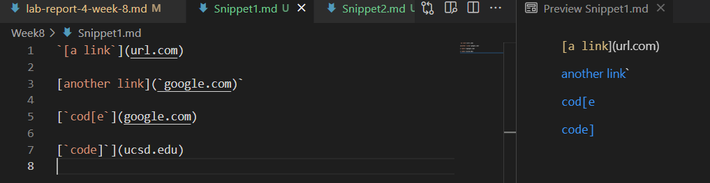
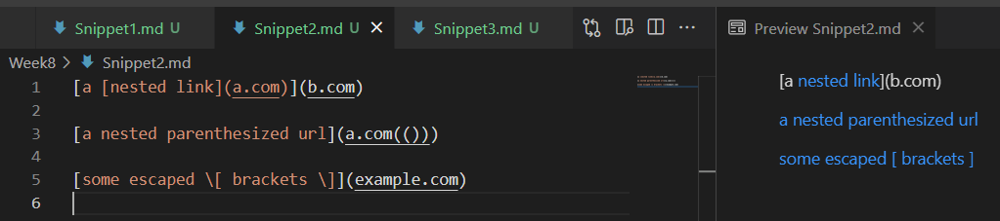

# How to use *JUnit* to run the given test and *Clean* our code to an optimal effiency?

* [Here](https://github.com/ericsun153/markdown-parser) is the link to **my** implementation of MarkdownParse repository.
* [Here](https://github.com/MichaelYe48/markdown-parser) is the link to my **peer's** implementation of MarkdownParse repository.

## Snippet 1
* After using the preview function VSCode, the expected result for Snippet 1 should be:

* As a result, its expected value should be

### My implementation on **MarkdownParser**
* Screenshot

### Peer's implementation on **MarkdownParser**
* Screenshot

## Snippet 2

* After using the preview function VSCode, the result for Snippet 2 should be:

* As a result, its expected value should be

### My implementation on **MarkdownParser**
* Screenshot

### Peer's implementation on **MarkdownParser**
* Screenshot

## Snippet 3

* After using the preview function VSCode, the result for Snippet 3 should be:

* As a result, its expected value should be

### My implementation on **MarkdownParser**
* Screenshot

### Peer's implementation on **MarkdownParser**
* Screenshot