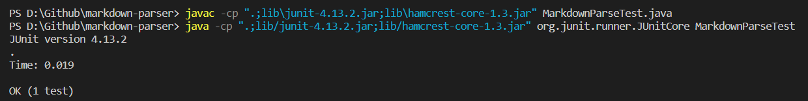
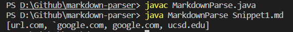
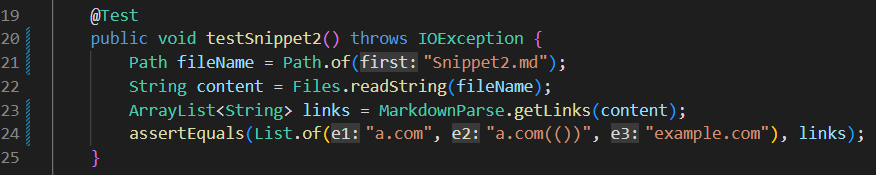
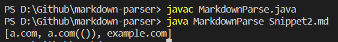
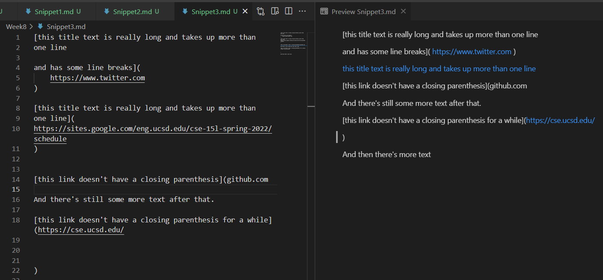

# How to use *JUnit* to run the given test and *Clean* our code to an optimal effiency?

* [Here](https://github.com/ericsun153/markdown-parser) is the link to **my** implementation of MarkdownParse repository.
* [Here](https://github.com/MichaelYe48/markdown-parser) is the link to my **peer's** implementation of MarkdownParse repository.

## Snippet 1
* After using the preview function VSCode, the expected result for Snippet 1 should be:

* As a result, its expected value should be `[url.com, `\``google.com, google.com, ucsd.edu]`. Moreover, here is the code used for testing Snippet 1 using *JUnit*:

### My implementation on **MarkdownParser**
* After I run the test on Snippet 1, we can see from the command line that it passes the test and the output is the same as we expected.

### Peer's implementation on **MarkdownParser**
* When running the test of Snippet 1 on my peer's repository of MarkdownParse, we can see that the test 

## Snippet 2

* After using the preview function VSCode, the result for Snippet 2 should be:

* As a result, its expected value should be `[b.com, a.com(()), example.com]`. Moreover, here is the code used for testing Snippet 2 using *JUnit*:

### My implementation on **MarkdownParser**
* After I run the test for Snippet 2, JUnit shows failure on testing. And the following screenshot from the command line have showed the difference between actual and expected value of my program work.

### Peer's implementation on **MarkdownParser**
* Screenshot

## Snippet 3

* After using the preview function VSCode, the result for Snippet 3 should be:

* As a result, its expected value should be `[https://www.twitter.com, https://sites.google.com/eng.ucsd.edu/cse-15l-spring-2022/schedule, https://cse.ucsd.edu/]`. Moreover, here is the code used for testing Snippet 3 using *JUnit*:

### My implementation on **MarkdownParser**
* After I run the test for Snippet 3, JUnit shows failure on testing. And the following screenshot from the command line have showed the difference between actual and expected value of my program work.

### Peer's implementation on **MarkdownParser**
* Screenshot

## More on Snippets
* For Snippet 1, it seems my program work has already passed the test, so there is unnecessary to have a code change. As a result, I think the my codes can be cleaned and make it into a more efficient program.

* For Snippet 2, my program work didn't pass the test.

* For Snippet 3, my program work didn't pass the test.
