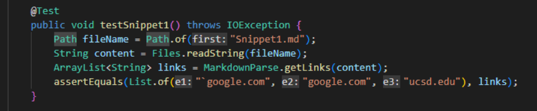
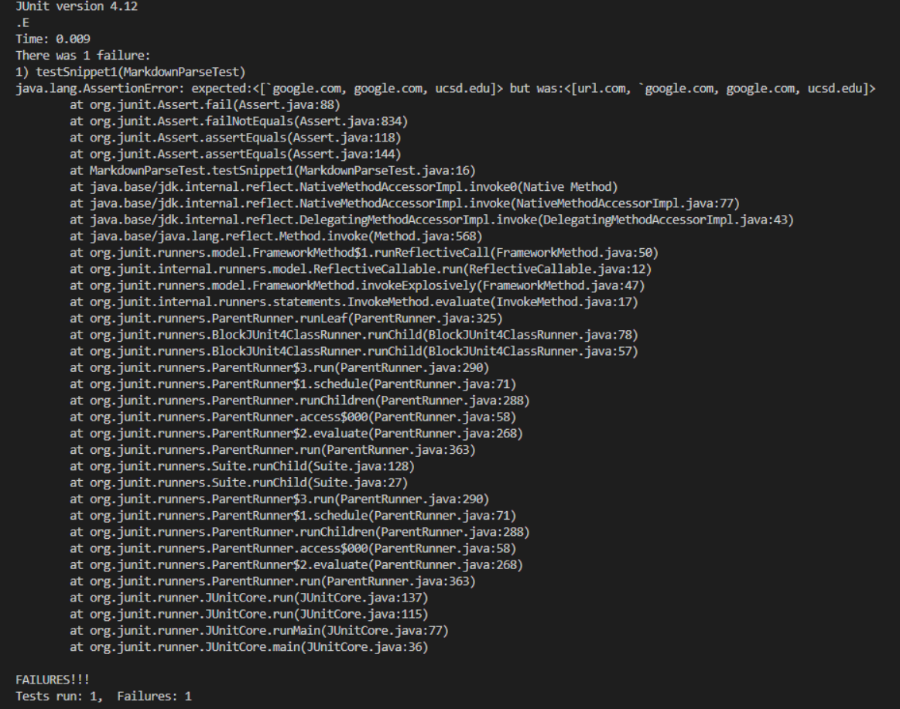
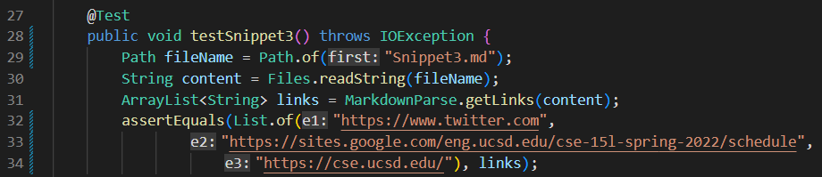

# How to use *JUnit* to run the given test and *Clean* our code to an optimal effiency?

* [Here](https://github.com/ericsun153/markdown-parser) is the link to **my** implementation of MarkdownParse repository.
* [Here](https://github.com/MichaelYe48/markdown-parser) is the link to my **peer's** implementation of MarkdownParse repository.

## Snippet 1
* After using the preview function VSCode, the expected result for Snippet 1 should be:

* As a result, its expected value should be `[url.com, `\``google.com, google.com, ucsd.edu]`. Moreover, here is the code used for testing Snippet 1 using *JUnit*:

### My implementation on **MarkdownParser**
* After I run the test for Snippet 3, JUnit shows failure on testing. And the following screenshot from the command line have showed the difference between actual and expected value of my program work.

### Peer's implementation on **MarkdownParser**
* When running the test of Snippet 1 on my peer's repository of MarkdownParse, we can see that the test also not passes.

## Snippet 2

* After using the preview function VSCode, the result for Snippet 2 should be:

* As a result, its expected value should be `[a.com, a.com(()), example.com]`. Moreover, here is the code used for testing Snippet 2 using *JUnit*:

### My implementation on **MarkdownParser**
* After I run the test for Snippet 2, JUnit test was passed. And the following screenshot from the command line have showed the actual and expected value of my program work.

### Peer's implementation on **MarkdownParser**
* After running the test for Snippet 2, my peer's program work fail the test.

## Snippet 3

* After using the preview function VSCode, the result for Snippet 3 should be:

* As a result, its expected value should be `[https://www.twitter.com, https://sites.google.com/eng.ucsd.edu/cse-15l-spring-2022/schedule, https://cse.ucsd.edu/]`. Moreover, here is the code used for testing Snippet 3 using *JUnit*:

### My implementation on **MarkdownParser**
* After I run the test for Snippet 3, JUnit shows failure on testing. And the following screenshot from the command line have showed the difference between actual and expected value of my program work.

### Peer's implementation on **MarkdownParser**
* After running the test for Snippet 3, my peer's program work fail the test.

## More on Snippets
* For Snippet 1, my program work didn't pass the test. My actual output of the code has the additional the first element of `url.com`. I think this can be solved in less than 10 lines. Because the code symbol appeared the first in the line, my program can not recognize it so it will output the result of `url.com`. For fixing it, I think the code must be changed to filter different kind of symbols in markdown language, and only when the pairs of brackets and parentheses are detected then we output the link.

* For Snippet 2, it seems my program work has already passed the test, so there is unnecessary to have a code change. For my program, I think what makes it passes the test is because I have used Map to find the first pair of parentheses in each line and after found in each line, the program goes next line. But for my peer's program work, I think his code is more focusing on finding the first and second parentheses after the pair of bracket, so when there is nested links, his code cannot be solved. I think this can be solved under 10 lines as he needs only add one more condition for appearing opening and closing parentheses in the range of a paired brackets.

* For Snippet 3, my program work didn't pass the test. My actual output of the code is missing the last element of `https://cse.ucsd.edu`. I think this can be also solved in less than 10 lines. I need to change the condition of my method that finding the index of the close parentheses, I need to update the situation when there are more spaces and new lines between the opening and closing parentheses of the link as expected.
