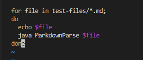
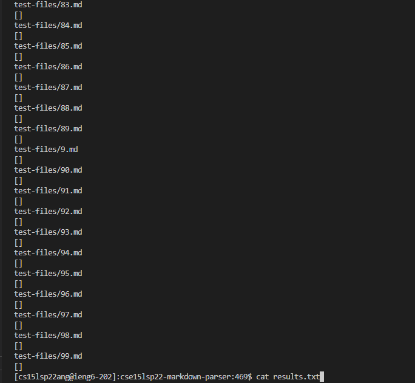
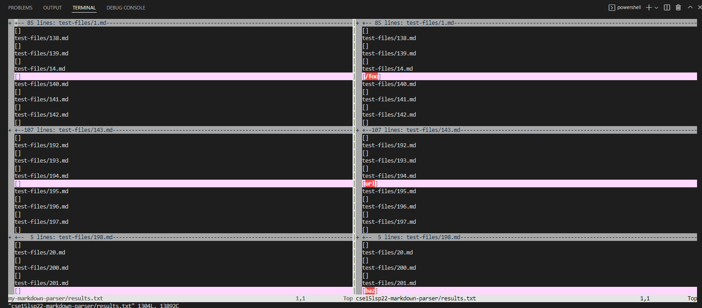
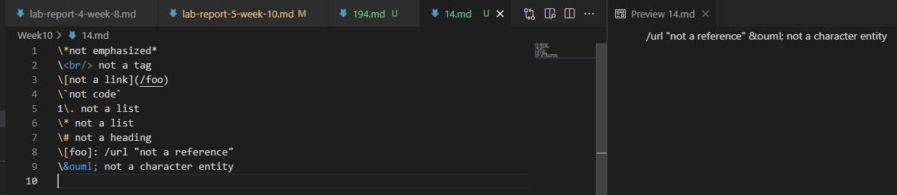
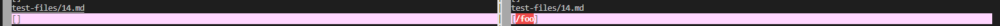
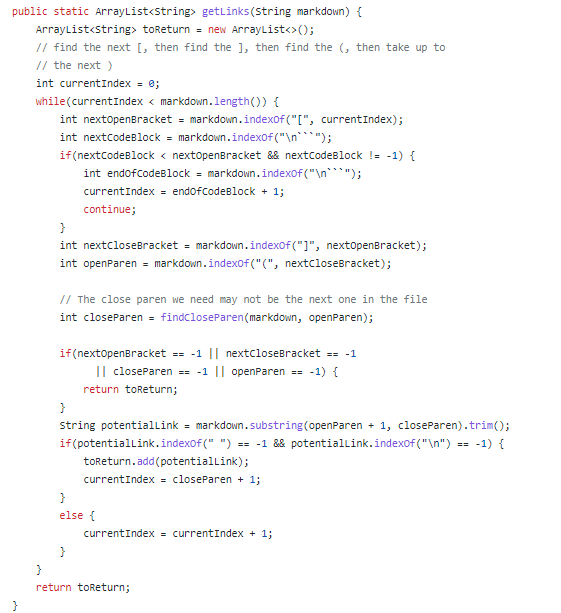
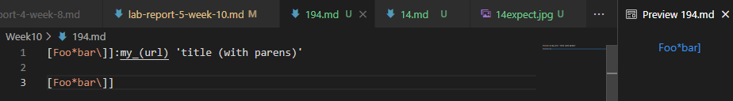
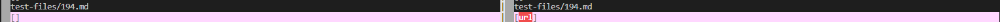
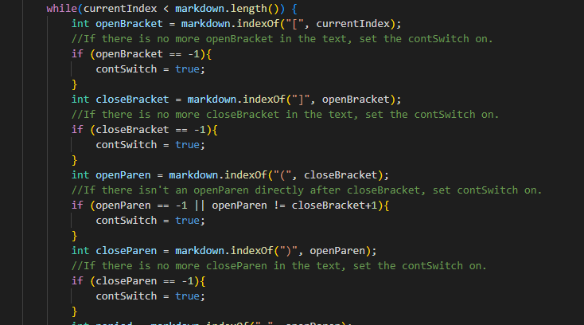

# How to use *bash script* to get the result of different tests and in this way improve our program?

## Comparing different results of test
* First of all, we should clone the updated version of Markdown-parser using `git clone https://github.com/nidhidhamnani/markdown-parser.git cse15lsp22-markdown-parser`

* After `vim` into the **script.sh** file, we insert a line before running the test to return the filename of each file in the **test-files** folder by using the command `echo`.



* We run `bash script.sh > results.txt` in order to store all the test result into a single txt file, we can see the contents by using `cat results.txt`.



* In order to comparing different results of test cases, we can also clone our own implementation of markdown-parser by using `git clone <your-markdown-parser> my-markdown-parser`. Then we copy the **test-files** folder and the **script.sh** to our own folder:

```
cp -r cse15lsp22-markdown-parser/test-files my-markdown-parser/
cp cse15lsp22-markdown-parser/script.sh my-markdown-parser/
```

* After this step, we follow the above steps again to store the new test results into **results.txt** in **my-markdown-parser**.

* We then compare these two txt files using the command of `vimdiff`, and we can see the different results due to different implementations of markdown-parser:



* As shown from the `vimdiff` result, in the following content I will use **14.md** and **194.md** as my examples.

The [Link](https://github.com/nidhidhamnani/markdown-parser/blob/main/test-files/14.md) of **14.md**.

The [Link](https://github.com/nidhidhamnani/markdown-parser/blob/main/test-files/194.md) of **194.md**.

## More on **14.md**
We can able to find the expected output by using the preview function of markdown language:



* From the `vimdiff`, we can find two different results of our implementations on **14.md**.



* According to the preview that we saw, my implementation has the correct implementation but the latest shared version is not, as it should output nothing `[]`.

* For my implementation, I think the reason why I get the right output is that I have seperately considering different test cases that I met, and if the case is outside my consideration, the output will always return `[]`, so my implementation is the same as the expected one.

* For the latest shared version of Markdown-parser, the bug appeared because there is an special character `\` in front of the opening bracket, so the opening bracket become an escape character. Normally it should not be count as a link, but our shared version did not filter it successfully. Some modification can be made in the implementation of the `getLinks` method. In the while loop, we can add an additional condition when specific symbols like `\` or \` are appearing just in front of or behind the brackets or parentheses. When specific characters are detected, the output should directly not include any links from the current line in the markdown.



## More on **194.md**
We can able to find the expected output by using the preview function of markdown language:



* From the `vimdiff`, we can find two different results of our implementations on **194.md**.



* According to the preview that we saw, the latest shared version has the correct implementation but my implementation is not, as it should output `[url]`.

* I think the reason why the shared version passes the test because it uses the `Map` interface to carry out the method of `getLinks`. After it gets a pair of brackets, the program will continue to find the next and first-appeared open and closing parentheses in the same line, if not found, return `[]`, if found, return the link inside the parentheses, therefore the shared version can return the correct output as expected.

* For my implementation, previously I didn't consider too much on this situation, so the bug is that my program automatically filtered this test case to "no link" cases. I think improvement and modification can be made in the while loop in the `getLinks` method. I can add more condition on different if statements to make no influence when there is different characters and symbols between the first pair of brackets and the first pair of parentheses.


